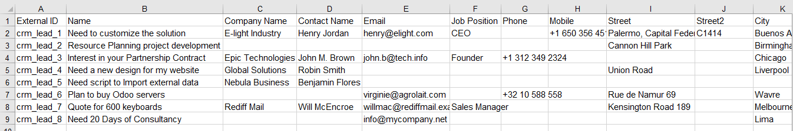
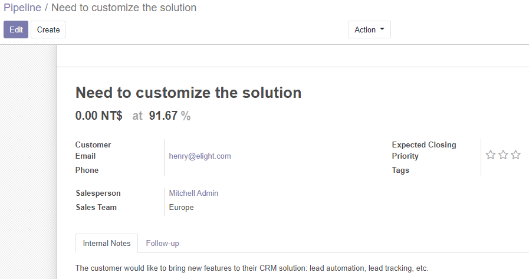
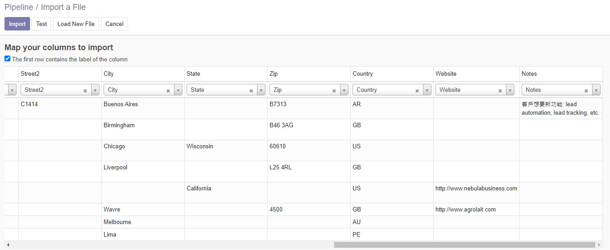
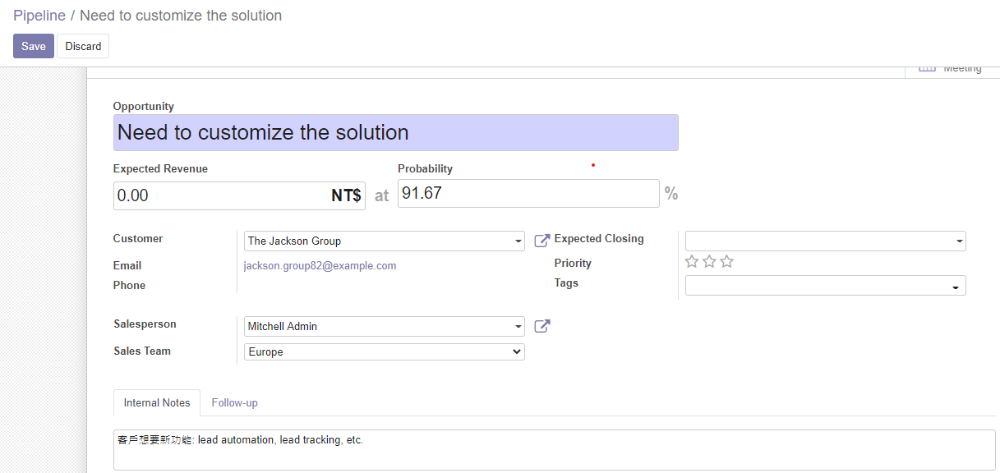
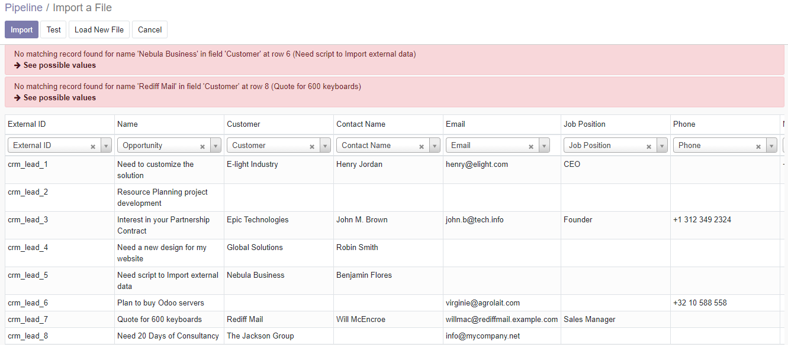

# Install

[bitnami install](http://bitnami.com/stack/odoo/installer). only show up BITROCK_APPLICATION_ORIGINALNAME page
Instead of `sudo systemctl start docker` use `sudo /etc/init.d/docker start` [as no systemd in WSL2](http://github.com/MicrosoftDocs/WSL/issues/457) [for now](https://github.com/microsoft/WSL/issues/2380).

# Odoo-bin Shell

  /home/marr/.local/lib/python3.6/site-packages/psycopg2/__init__.py:144: UserWarning: The psycopg2 wheel package will be renamed from release 2.8; in order to keep installing from binary please use "pip install psycopg2-binary" instead. For details see: <http://initd.org/psycopg/docs/install.html#binary-install-from-pypi>.

# 網域設定

https://www.odoo.com/blog/odoo-news-5/post/get-your-ssl-certificate-automatically-on-odoo-558 1. 在 DNS entry 寫 CNAME 2. 在 Odoo 設定主機名稱 3. 使用 https://odoo.mysite.com 之類的網址

# Session Expire

預設時間長度? 設定方式? https://www.facebook.com/groups/odoo.taiwan/permalink/4786510434722803/

addons/web/static/src/js/services/crash_manager.js

    core.crash_registry.add('odoo.http.SessionExpiredException', session_expired);

# 資料庫復原

database restore error access denied 通常代表 Master Password 錯誤，把 odoo-server.conf 的 admin_password 修改後就可以匯入。
以 mydb-20201001.zip 備份檔案為例，匯入時可以指定新資料庫名稱，例如 yourdb 就可以避免重覆。

# 客戶名單

合併: 春嬌建立了一筆 Individual 名稱是谷歌公司，填了電郵，並在客戶關係裡建立 Opportunity，系統記錄 ID 是 2581。志銘想要透過合併方式來修訂，先建立一筆 Company 名稱是谷歌公司，其他欄位都未填，系統記錄 ID 是 2596。選擇這兩筆在執行合併時，要先指定 Destination Contact 是志銘的資料，因為志銘資料是新的，下拉選單裡要選擇下方項目。合併結果的編輯記錄呈現，最早建立者還是春嬌，接著記錄志銘的建立時間，再記錄春嬌的 Opportunity 時間，最後是合併時間和內容像 Merged with the following partners: 谷歌公司 <some@gmail.com> (ID 2581)。

Opportunity 客戶選 Company 時，Contact 裡 Company 的 Opportunity 單獨會加總，客戶選 Inidividual 時，Company 和 Individual 都會同時加總。也就是說，有歸戶到 Company 的效果。

# 資料匯入與匯出

以 CRM 為例，它的範例 crm_lead.xls 可能版本過舊，目前懷疑不適用。遇到的問題是，範例欄位依序是 External ID, Name, Company Name, Contact Name, Email, Job Position, Phone, Mobile 其中 Name 該對應 Opportunity 而 Company Name 該對應 Customer。至於 Contact Name 之類的欄位，如果 Customer 匯入值跟 Contact 既有值一致，預設就會自動帶入 Contact 裡包括 Email, Phone 的值，這時匯入的 Email, Phone 並不用被採用，如果 Customer 匯入值並沒有和 Contact 既有值一致，則會匯入 Email (Phone not sure yet) 的值，另外 Notes 欄位值會被匯入及更新之外。

如果 Customer 欄位的值並未出現在 Contact 裡，會出現 No matching record found for name 'SomeOne' in field 'Customer' at row 2 (Opportunity One) → See possible values

在 Technical Mode 檢視欄位技術資訊後，可以明確對應匯入的欄位名稱，並利用 ID (External_ID) 來保持資料一致性。

匯入流程測過 CSV 和 XLSX 格式，都成功?

    --
    -- Name: res_partner; Type: TABLE; Schema: public; Owner: odoo
    --
    
    CREATE TABLE public.res_partner (
        id integer NOT NULL,
        name character varying,
        company_id integer,
        create_date timestamp without time zone,
        display_name character varying,
        date date,
        title integer,
        parent_id integer,
        ref character varying,
        lang character varying,
        tz character varying,
        user_id integer,
        vat character varying,
        website character varying,
        comment text,
        credit_limit double precision,
        active boolean,
        employee boolean,
        function character varying,
        type character varying,
        street character varying,
        street2 character varying,
        zip character varying,
        city character varying,
        state_id integer,
        country_id integer,
        partner_latitude numeric,
        partner_longitude numeric,
        email character varying,
        phone character varying,
        mobile character varying,
        is_company boolean,
        industry_id integer,
        color integer,
        partner_share boolean,
        commercial_partner_id integer,
        commercial_company_name character varying,
        company_name character varying,
        create_uid integer,
        write_uid integer,
        write_date timestamp without time zone,
        message_main_attachment_id integer,
        email_normalized character varying,
        message_bounce integer,
        signup_token character varying,
        signup_type character varying,
        signup_expiration timestamp without time zone,
        calendar_last_notif_ack timestamp without time zone,
        partner_gid integer,
        additional_info character varying,
        team_id integer,
        phone_sanitized character varying,
        website_id integer,
        is_published boolean,
        website_meta_title character varying,
        website_meta_description text,
        website_meta_keywords character varying,
        website_meta_og_img character varying,
        website_description text,
        website_short_description text,
        CONSTRAINT res_partner_check_name CHECK (((((type)::text = 'contact'::text) AND (name IS NOT NULL)) OR ((type)::text <> 'contact'::text)))
    );

    --
    -- Name: crm_lead; Type: TABLE; Schema: public; Owner: odoo
    --

    CREATE TABLE public.crm_lead (
        id integer NOT NULL,
        campaign_id integer,
        source_id integer,
        medium_id integer,
        email_cc character varying,
        message_main_attachment_id integer,
        message_bounce integer,
        email_normalized character varying,
        name character varying NOT NULL,
        partner_id integer,
        active boolean,
        date_action_last timestamp without time zone,
        email_from character varying,
        website character varying,
        team_id integer,
        description text,
        contact_name character varying,
        partner_name character varying,
        type character varying NOT NULL,
        priority character varying,
        date_closed timestamp without time zone,
        stage_id integer,
        user_id integer,
        referred character varying,
        date_open timestamp without time zone,
        day_open double precision,
        day_close double precision,
        date_last_stage_update timestamp without time zone,
        date_conversion timestamp without time zone,
        probability double precision,
        automated_probability double precision,
        phone_state character varying,
        email_state character varying,
        planned_revenue numeric,
        expected_revenue numeric,
        date_deadline date,
        color integer,
        street character varying,
        street2 character varying,
        zip character varying,
        city character varying,
        state_id integer,
        country_id integer,
        lang_id integer,
        phone character varying,
        mobile character varying,
        function character varying,
        title integer,
        company_id integer,
        lost_reason integer,
        create_uid integer,
        create_date timestamp without time zone,
        write_uid integer,
        write_date timestamp without time zone,
        CONSTRAINT crm_lead_check_probability CHECK (((probability >= (0)::double precision) AND (probability <= (100)::double precision)))
    );

在 Export Data 勾選 I want to update data 指定 CSV 匯出格式，從 Available Fields 把 Activites 加進 Fileds to Export。匯出的結果顯示 activity_ids 欄位的值是像 Send Proposal 這樣，證實此處的 ids 是指 title 之意。再把相關細節欄位都匯出後，就容易找到需要的資訊：
Activities | activity_ids: Send Proposal
Activities/Activity Type | activity_ids/activity_type_id: Email
Activities/Activity Type/External ID | activity_ids/activity_type_id/id: mail.mail_activity_data_email
Activities/Activity Type/Name | activity_ids/activity_type_id/name: Email
Activities/Due Date | activity_ids/date_deadline: 2020–06–01
Activities/External ID | activity_ids/id: __export__.mail_activity_22_fdab3f8c
Activities/Note | activity_ids/note: 
To see if this record will appear.

# 搜尋條件的領域設定

crm_lead.py

    partner_id = fields.Many2one('res.partner', string='Customer', tracking=10, index=True,
        domain="['|', ('company_id', '=', False), ('company_id', '=', company_id)]", help="Linked partner (optional)...
    
    partner_id = fields.Many2one('res.partner', string='Customer', tracking=10, index=True,
        domain="['&', ('name', 'not like', 'TSMC'), ('company_id', '=', company_id)]", help="Linked partner (optional)...

搜尋 Customer 時，只會找 TSMC 的人員。

        domain="['&', ('name', 'not like', 'TSMC'), ('company_id', '=', company_id)]",

只剩 TSMC 公司

# 網頁樣版的復原

在 Template ID: website.homepage 的 
 下方新增 JavaScript 嵌入碼，可以正常生效。

    <t name="Homepage" t-name="website.homepage1">
        <t t-call="website.layout">
            <t t-set="pageName" t-value="'homepage'"/>
            

    

    
    
    

            </t>
        </t>

website.homepage 是在 https://github.com/odoo/odoo/blob/13.0/addons/website/models/website.py#L207 由 `_bootstrap_homepage()` 產生，並會指定 priority 值。

# OCA

[Contributing Guideline](http://github.com/OCA/odoo-community.org/blob/master/website/Contribution/CONTRIBUTING.rst)
模組名稱開頭與其代表的角色
base_: 其他模組的基礎
l10n_: 在地化的模組
crm_partner_firstname: 整合 Odoo CRM 與 OCA partner_firstname 模組

可利用 oca-gen-addon-readme 自動產生說明文件

