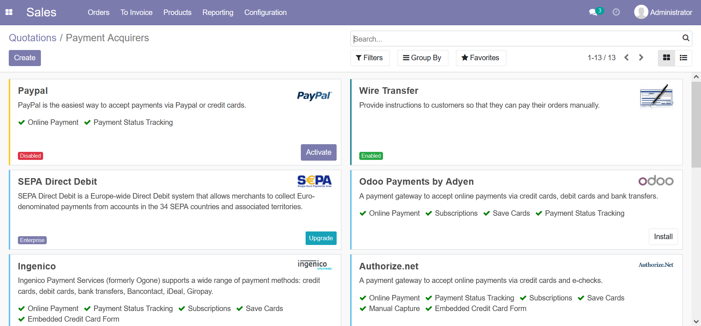

# Accounting and Invoicing

Invoicing 是輕量級的財會模組，通常用於 Invoice Online Payment 線上付款的場景。
Accounting 是

啟用 Paypal Payment Acquirer 會同時啟用 Invoicing 但沒有啟用 Sales

[Invoicing Onboarding Banner](https://www.odoo.com/documentation/14.0/applications/finance/accounting/getting_started/initial_configuration/setup.html#invoicing-onboarding-banner)

[Invoice Online Payment](https://www.odoo.com/documentation/14.0/applications/finance/accounting/receivables/customer_payments/online_payment.html)

# Sales

啟用後要設定 Quotation

Choose how to confirm quotations: Electronic signature ; PayPal ; Credit card (via Stripe) ; Other payment acquirer ; Custom Payment instructions

# Timesheets

[Invoicing for Service Companies](https://www.youtube.com/watch?v=ZTMUeHUZKVI) 服務型公司通常透過 Timesheet 來計費

